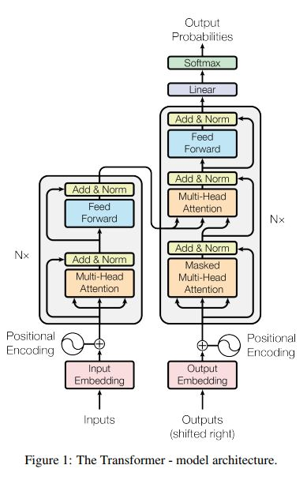
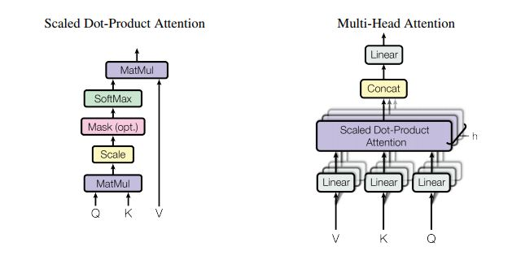
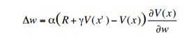
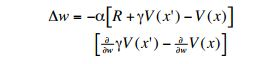
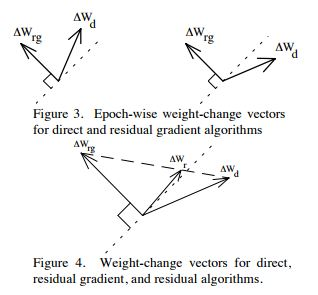

# papers
List of papers I have read, am reading and want to read starting 1st Sept 2017.

## Read

- [Asynchronous Methods for Deep Reinforcement Learning](https://arxiv.org/pdf/1602.01783.pdf) - ICML 2016 - [RL]

  

  aka A3C. Instead of training on samples from replay memory to decorrelate temporal relations, use multiple agents operating in their own copy the environment using a current global policy. Training becomes more stable. Beats the previous best in half the training time. Train k agents on a single k-core CPU. No communication costs as with [Gorrila](https://arxiv.org/abs/1507.04296). In case of off-policy learning the individual agents can apply different policies which is more explorative and stable. Replay memory can still be used with this to increase data-efficiency.
  

- [Unsupervised Domain Adaptation by Backpropagation](https://arxiv.org/abs/1409.7495) - 2014 - [CV] [GANs]
  

  It's a GAN in disguise. You datasets from 2 domains - 1) labelled synthetic image classes and 2) unlabelled real images. You want to label the images from real domain. Idea: There are three NN modules - G, C and D. Domain invariant features must be learn by network G. Feed the features to their equivalent of a discriminator (D), penalize N if D can predict domain from given features. Also feed the same features to classifier C train it to label the synthetic data. Over time D can't tell the domain, the features learnt are domain-invariant and by the covariate shift assumption network [G --> C] becomes good at classifying unlabelled real images.
  

- [Learning to Repeat: Fine Grained Action Repetition for deep reinforcement learning](https://arxiv.org/pdf/1702.06054.pdf) - ICLR 2017 - [RL]
  

  aka FiGAR. In policy gradient method, instead of just predicting the next action `a` from a set of actions `A` (continuous or discrete) predict a tuple (`a`, `w`) from `A` (actions) and a set of discrete integers `W`. Repeat action `a` for the next `w` time-steps. The intuition is this: in many situations you want to repeat the same action over a long range of time-steps. Decouple the prediction of `a` from `w` prevent the network from blowing up.
  

- [Attention Is All You Need](https://arxiv.org/pdf/1706.03762.pdf) by Ashish Vaswani et. al - 2017 - [DL]
  

    
 novelty - 10/10. Fixed number of Attend and Analyse steps == number of stacked Transformer units (6 in the paper). Transformer unit: Consists of 1) an encoder layer 2) a decoder layer. Both layers contain a sub layer for attention and a fully connected sub-layer. The decoder contains and addition masking layer for preventing the decoder from seeing current and future token. Multiple smaller attention heads used instead of single big attention head. Positional information of both input and output sequences are fused into the embeddings before feeding it to the first Transformer layer. After that the order input or output tokens doesn't matter until the next Transformer unit. Positional encoding is cleverly designed to support relative indexing for attention. 

  
  

  
- [Residual Algorithms: Reinforcement Learning with Function Approximation](http://www.leemon.com/papers/1995b.pdf) by L. Baird - 1995 - [RL]
  

  TD(0) updates guaranteed to converge for table lookup but not for function approximators. Enter, Residual Gradient updates: Define a loss function E over the Bellman residue (RHS-LHS of Bellman eq.). Do gradient descent on w.r.t to E --> Guaranteed to converge but slow. Slow because the updates go both ways (next_state_action <--> this_state_action). Enter, Residual (delta_w_r) updates: Hit a compromise b/w TD(0) (delta_w_d) and Residual Gradient (delta_w_rg).
  
  TD(0) update
  
  
  Residual Gradient update
  
  
  
  
  Dotted line is the hyperplane perpendicular to the true gradient w.r.t residue (need to stay left of it for robustness). Mustn't go far from TD(0) update (the direction of fast learning). Idea: take projection of TD(0) update w.r.t dotted line, nudge it slightly to the left.
  
  

  
  
## Reading
- [Learning from Simulated and Unsupervised Images through Adversarial Training](https://arxiv.org/pdf/1612.07828.pdf) - CVPR 2017 - [GANs]
  - Generating original-like synthetic data using GANs

## Want to Read
- [Playing Atari with Deep Reinforcement Learning](https://arxiv.org/abs/1312.5602) - NIPS 2013 - [RL]
- [A Brief Survey of Deep Reinforcement Learning](https://arxiv.org/pdf/1708.05866.pdf) - IEEE 2017 - [RL] [Survey]
- [Skip-Thought Vectors](http://papers.nips.cc/paper/5950-skip-thought-vectors.pdf) - NIPS 2015 - [NLP]
- [Improved Training of Wasserstein GANs](https://arxiv.org/pdf/1704.00028.pdf) - 2017 - [GANs]
- [Strategic Attentive Writer for Learning Macro-Actions](https://arxiv.org/pdf/1606.04695.pdf) - NIPS 2016 - [RL]
- [Evolution Strategies as a Scalable Alternative to Reinforcement Learning](https://arxiv.org/pdf/1703.03864.pdf) - 2017 - [RL]
- [Deep Photo Style Transfer](https://arxiv.org/pdf/1703.07511v1.pdf) - 2017 - [DL] [CV]
- [Adam: A method for stochastic optimization](http://arxiv.org/pdf/1412.6980) - 2014 - [Optim]
- [Semantic understanding of scenes through the ADE20K dataset](https://arxiv.org/pdf/1608.05442) - 2016 - [CV]
- [Representation Learning: A Review and New Perspectives](https://arxiv.org/pdf/1206.5538.pdf) - 2013 - [DL] [Survey]
- [Show, attend and tell: Neural image caption generation with visual attention](https://arxiv.org/pdf/1502.03044.pdf) - [CV]
- [A Hierarchical Latent Variable Encoder-Decoder Model for Generating Dialogues](https://arxiv.org/pdf/1605.06069.pdf) - 2016 - [NLP]
- [Hierarchical multiscale recurrent neural networks](https://arxiv.org/pdf/1609.01704) - 2016 - [RNNs]
- [Generative Adversarial Nets](https://arxiv.org/pdf/1406.2661.pdf) - 2014 - [GANs]
- [An actor-critic algorithm for sequence prediction](https://arxiv.org/pdf/1607.07086) - 2016 - [RL]
- [Unitary evolution recurrent neural networks](http://www.jmlr.org/proceedings/papers/v48/arjovsky16.pdf) - ICML 2016 - [RNNs]
- [Deconstructing the ladder network architecture](http://www.jmlr.org/proceedings/papers/v48/pezeshki16.html) - ICML 2016 - [DL]
